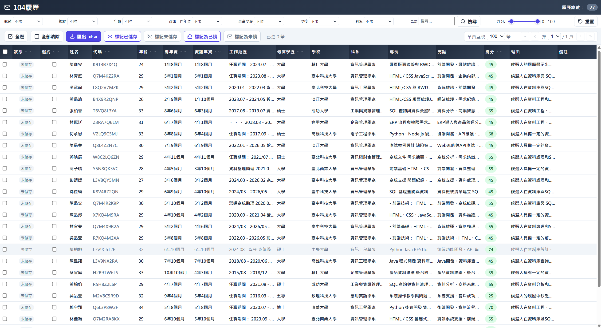
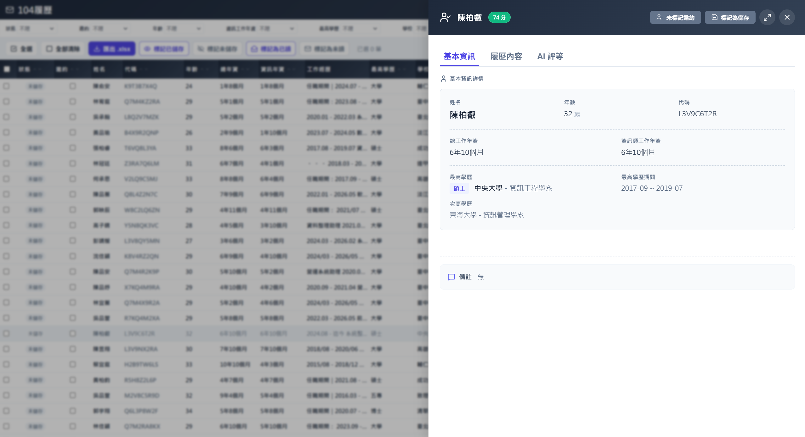
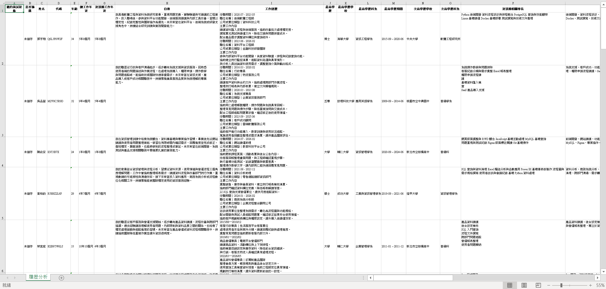

# Resume Analysis System - A resume analysis and candidate screening system built with Python, Flask, SQLite, and OpenAI API.
This project automates the process of reading PDF resumes, extracting structured information, evaluating candidate-job fit, storing analysis results, and presenting them through a web-based dashboard.
## Project Motivation
The motivation for this project came from the repetitive and time-consuming nature of resume screening. When the number of resumes increases, HR needs to read each resume, organize candidate information, and compare it with job requirements.

Therefore, I built this project to use AI to analyze resume content, structure key information such as education, experience, skills, and job match, and provide a web interface for filtering and management. The goal is to make initial resume screening more efficient and candidate comparison easier.
## Preview Screen

## Built With
This project is built with the following technologies:
- **Backend**: 
  - **Python**: Used for resume reading, AI analysis workflow, database operations, and Flask backend logic.
  - **Flask**: Used to build the web application and render the resume management dashboard.
  - **SQLite**: Used as the local database for storing analyzed resume data.
  - **OpenAI API**: Used to analyze resume content, extract structured candidate information, generate summaries, and calculate job matching scores.
  - **pypdf**: Used to read and extract text from PDF resume files.
  - **pandas**: Used for data processing and preparing selected resume records for export.
  - **openpyxl**: Used to generate formatted Excel export files.
  - **Presidio Analyzer / Presidio Anonymizer**: Used to detect and mask sensitive personal information before AI processing.
- **Frontend**:
  - **HTML**
  - **CSS**
  - **JavaScript**
  - **Lucide Icons**
- **Configuration & Data**:
  - **config.ini**: Used to manage API key, model name, PDF folder path, database file path, and job description file path.
  - **JD.json**: Stores the job description, required skills, professional knowledge, personality traits, and experience requirements used for candidate matching.
## Screenshots
- Resume Dashboard & Filter and Search Area

- Slide Out Panel

- Excel Export Result

## Key Features
- **AI-Powered Resume Analysis**:
  - The project uses an AI model to analyze resume content. The analysis workflow includes three main stages:
      - **Basic Information Extraction**: Extracts structured candidate fields such as name, code, age, work experience, education, skills, and other resume information.
      - **Resume Summary Generation**: Summarizes the candidate’s experience, technical strengths, highlights, and notes.
      - **Job Matching Evaluation**: Compares the candidate profile with the job description stored in `JD.json` and generates a matching score with evaluation reasons.
- **Privacy-Aware Processing**:
Before sending resume text to the AI model, the system includes a privacy filtering step. Sensitive information such as names, email addresses, and phone numbers can be masked during processing.

  This design helps reduce exposure of personal data when performing AI-based resume analysis.
- **Web-Based Dashboard**:
The Flask web interface provides a resume management dashboard. Users can browse all analyzed resumes in a table, view essential candidate information, and interact with candidate records directly from the browser.
## Reflection
Through this resume analysis project, I learned how AI can support real work processes instead of simply replacing manual work. Resume screening includes many repetitive tasks, such as reading resumes, extracting education and experience, and comparing skills with job requirements. These tasks can be improved through system automation.

During development, I also found that resumes often have different formats and writing styles, so making the AI analyze information accurately was not easy. This project taught me that building a system is not only about completing functions, but also about considering data accuracy, workflow efficiency, and user experience.
## Contact
Name: Eileen (Hsu, Ying-Ying)

Email: xuyy04229@gmail.com

GitHub: https://github.com/EileenYY-Hsu
